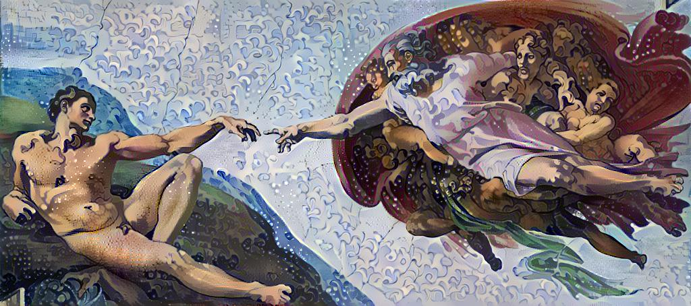

# Style transfer
Перенос стиля и объединение изображений.


Особенности: 
- В качестве основы и стилей можно использовать несколько изображений;
- Eсть дополнительная борьба с шумами на изображении;
- В качестве начального изображения можно взять как одно из основных, так и шум.

# Запуск

```
python3 -m venv --system-site-packages ./venv

source ./venv/bin/activate

pip install --upgrade pip

pip install -r requirements.txt

python main.py

deactivate

rm -rf venv
```

# Результаты

